# UML practice : solution (slide 68)

Énoncé : https://gist.github.com/bdallard/2d2407c4de4c182afca6d3ec7235e9eb

Les diagrammes sont en Mermaid (rendu direct dans GitHub, VS Code, Obsidian ou https://mermaid.live).
L'implémentation Python suit les diagrammes :

```bash
python3 hospital.py        # démo exo 1
python3 abcd_records.py    # démo exo 2
python3 -m unittest -v     # 14 tests
```

---

## Exo 1 : Hospital Management System

### Task 1 : les trois acteurs

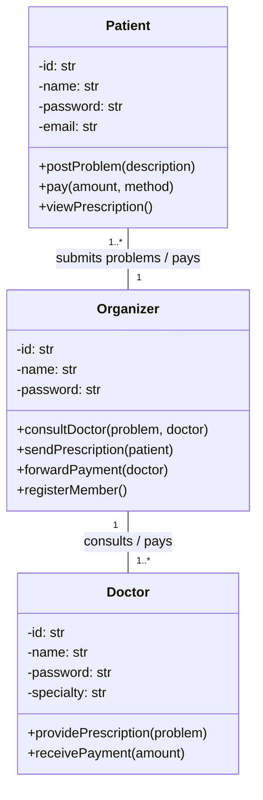

Le patient ne parle jamais directement au médecin : tout passe par l'organizer. Un seul organizer gère plusieurs patients et plusieurs médecins.

### Task 2 et Task 3 : diagramme complet

Ajouts de la Task 3 intégrés ici : superclasse `User`, statut du problème, horodatages, lien vers une ordonnance antérieure, paiement par polymorphisme (Strategy).

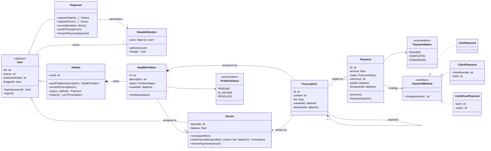

Choix de modélisation :

- Composition `Patient *-- HealthProblem` : un problème n'existe pas sans le patient qui l'a posté. Même chose pour `HealthProblem *-- Prescription`.
- Agrégation `HospitalSystem o-- User` : le système référence les utilisateurs mais ne définit pas leur existence.
- Paiement : une interface `PaymentMethod` et trois implémentations plutôt qu'une enum. Avec une enum, chaque nouveau moyen de paiement oblige à modifier un `if/elif` dans `Payment`. Avec l'interface, on ajoute une classe et rien d'autre ne change (principe ouvert/fermé).
- `CreditCardPayment` ne garde que les 4 derniers chiffres de la carte.

### Task 2 : séquence « un patient soumet un problème, reçoit une ordonnance et paie »

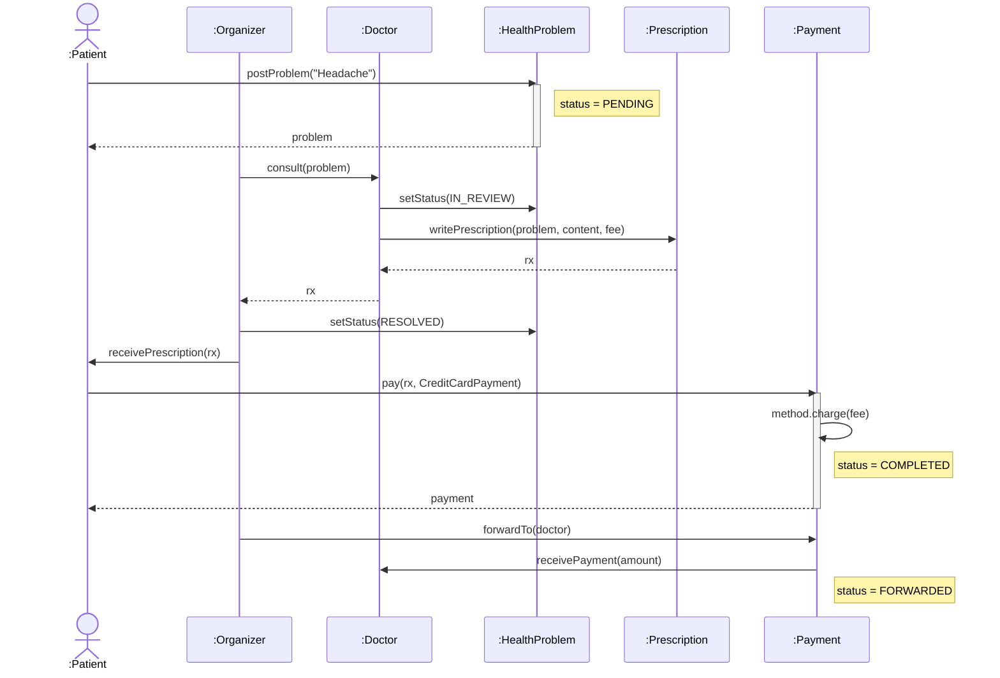

### Task 3 : diagrammes de séquence système

Dans un SSD, le système est une boîte noire : on ne montre que les échanges entre les acteurs et `:System`.

#### 1. Patient Registration

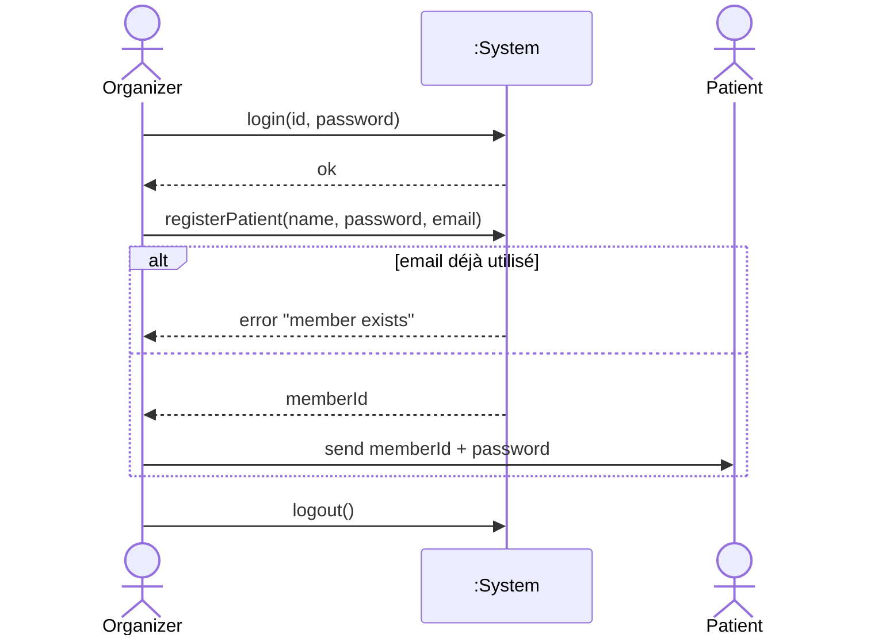

#### 2. Consultation Flow

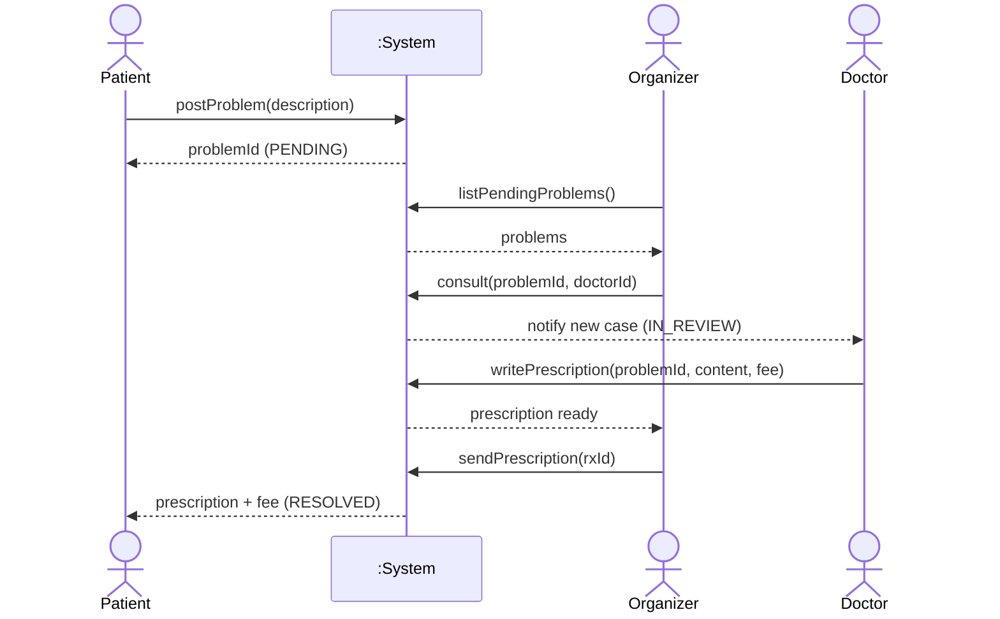

#### 3. Payment Processing

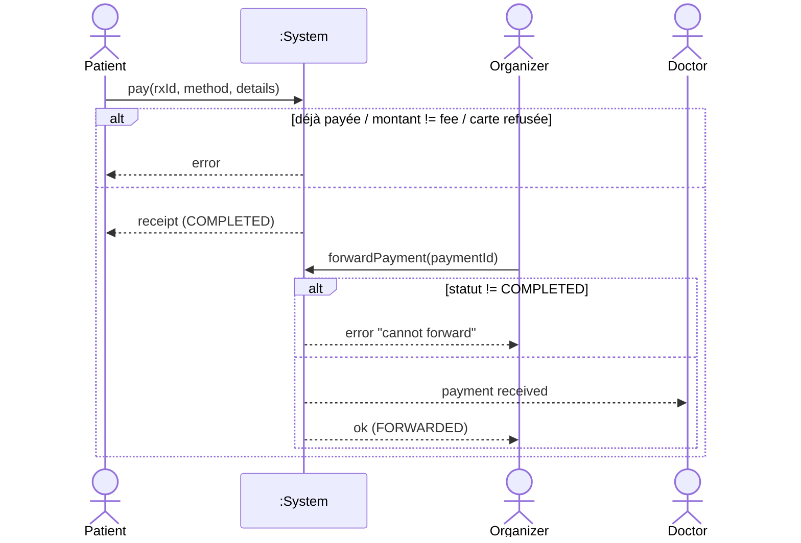

### Questions to consider

#### 1. Un patient qui consulte plusieurs médecins
Chaque `HealthProblem` a son propre médecin, donc un patient avec trois problèmes peut voir trois médecins. Si un même problème doit être vu par plusieurs médecins (second avis), on remplace l'association `HealthProblem --> Doctor` par une classe d'association `Consultation(problem, doctor, date, notes)` : multiplicité `HealthProblem 1 -- * Consultation * -- 1 Doctor`.

#### 2. Ordonnances réutilisables
Une ordonnance est un acte médical daté et signé : on ne la modifie pas, on ne la réutilise pas telle quelle. Pour un renouvellement, on crée une nouvelle `Prescription` avec `basedOn` pointant vers l'ancienne. On garde l'historique, et chaque renouvellement a son propre paiement. Si l'on veut des traitements types (« angine standard »), on ajoute une classe `PrescriptionTemplate` dont le médecin part pour rédiger une nouvelle ordonnance.

#### 3. Pattern pour le paiement
Strategy : `Payment` délègue `charge()` à un `PaymentMethod` interchangeable. On peut y ajouter une Factory qui construit la bonne stratégie à partir du choix de l'utilisateur (`"card"` → `CreditCardPayment`).

#### 4. Intégrité des paiements
Dans le code :
- montant contrôlé (égal à `fee`) ;
- pas de paiement avant la livraison de l'ordonnance, pas de second paiement (`prescription.payment` déjà renseigné) ;
- machine à états `PENDING → COMPLETED → FORWARDED` : on ne reverse pas deux fois le même paiement au médecin ;
- numéro de carte tronqué, mot de passe haché.

En production, il faudrait en plus une transaction en base (débit patient et crédit médecin validés ensemble ou pas du tout), une clé d'idempotence sur chaque requête de paiement, un journal d'audit en ajout seul, et un prestataire certifié PCI-DSS pour les cartes.

---

## Exo 2 : ABCD Records

### Level 1

#### Task 1.1 : use case simple

Mermaid n'a pas de diagramme de cas d'utilisation natif, on le simule avec un flowchart (ovales = cas d'utilisation).

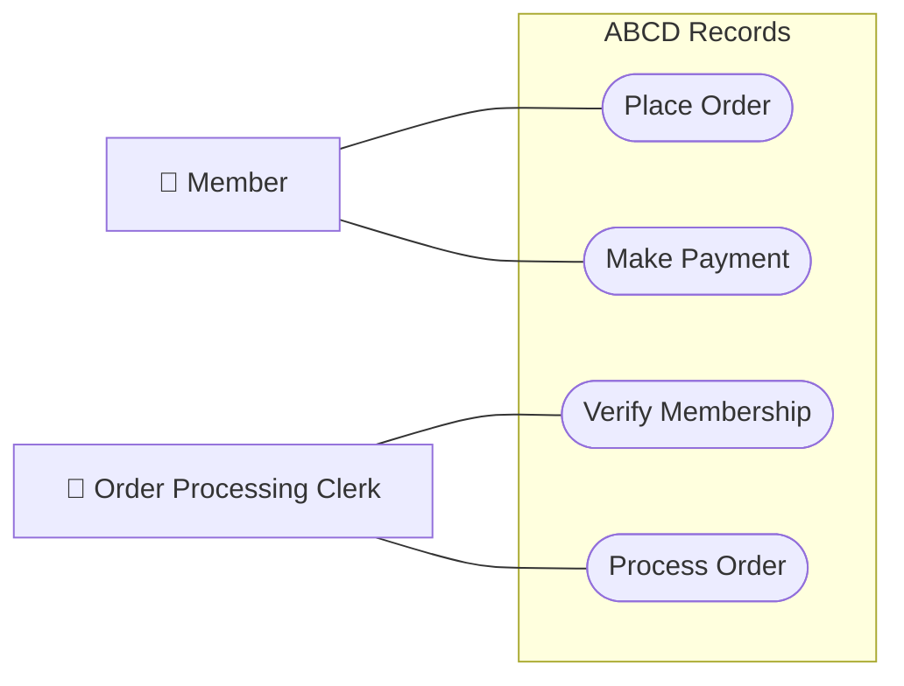

#### Task 1.2 : classes simples

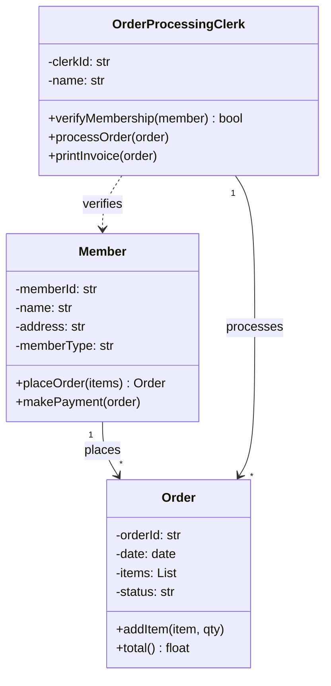

### Level 2

#### Task 2.1 : use case complet

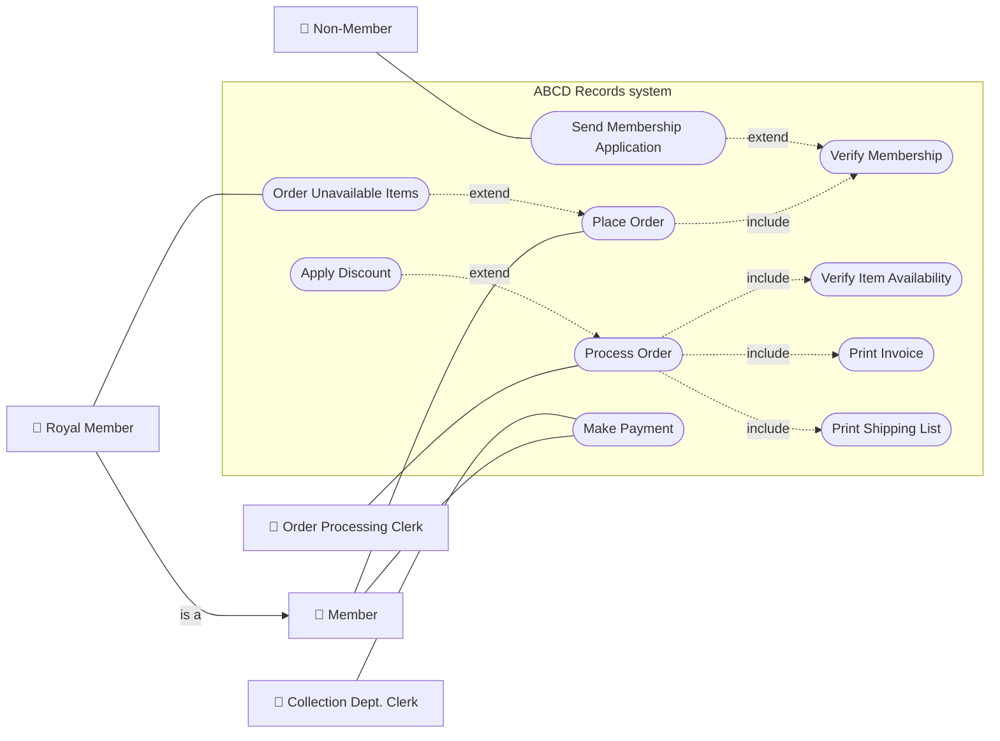

Lecture des relations :
- `<<include>>` : toujours exécuté. Toute commande passe par la vérification d'adhésion ; tout traitement vérifie le stock et imprime facture et bon d'expédition.
- `<<extend>>` : conditionnel, la flèche va de l'extension vers le cas de base. La remise ne s'applique que si le membre est Royal. La commande d'articles indisponibles n'est ouverte qu'aux Royal. Le formulaire d'adhésion part seulement si la vérification échoue.
- `Royal Member` hérite de `Member` (généralisation d'acteur) : il fait tout ce que fait un membre, plus « Order Unavailable Items ».

#### Task 2.2 : classes complètes

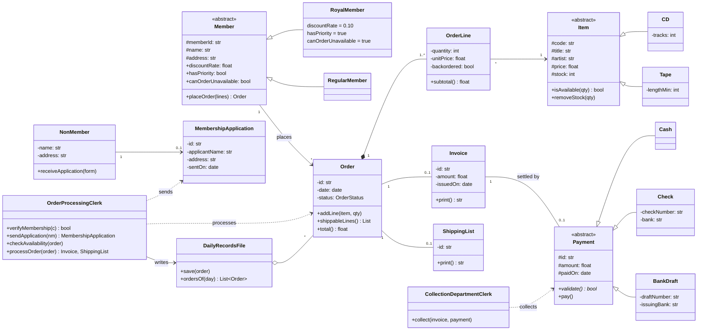

`OrderLine` est la classe qui porte la quantité et le prix au moment de la commande. Sans elle, il faudrait une association N-N entre `Order` et `Item`, et un changement de prix du catalogue modifierait les anciennes commandes.

#### Scénario : un membre Royal commande 2 CD (dont un indisponible) et paie par chèque

Diagramme d'objets :

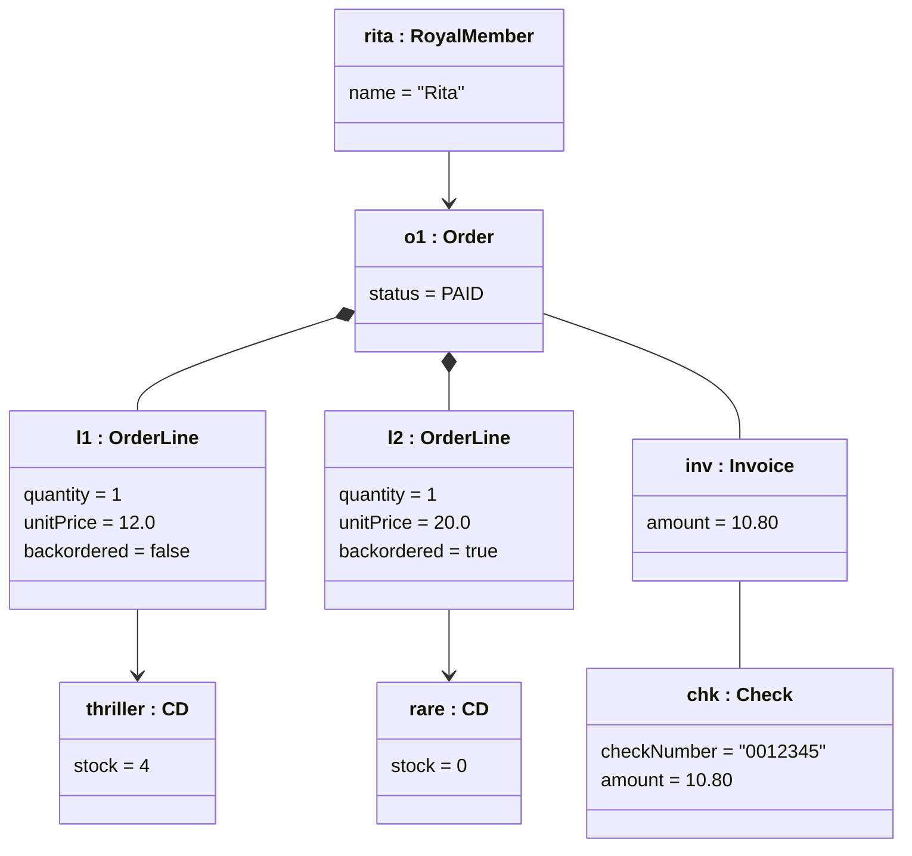

Seul le CD disponible est facturé (12 € − 10 % = 10,80 €). L'autre est mis en réapprovisionnement et sera facturé à l'expédition.

### Level 3 : séquences

#### 1. Traitement complet d'une commande

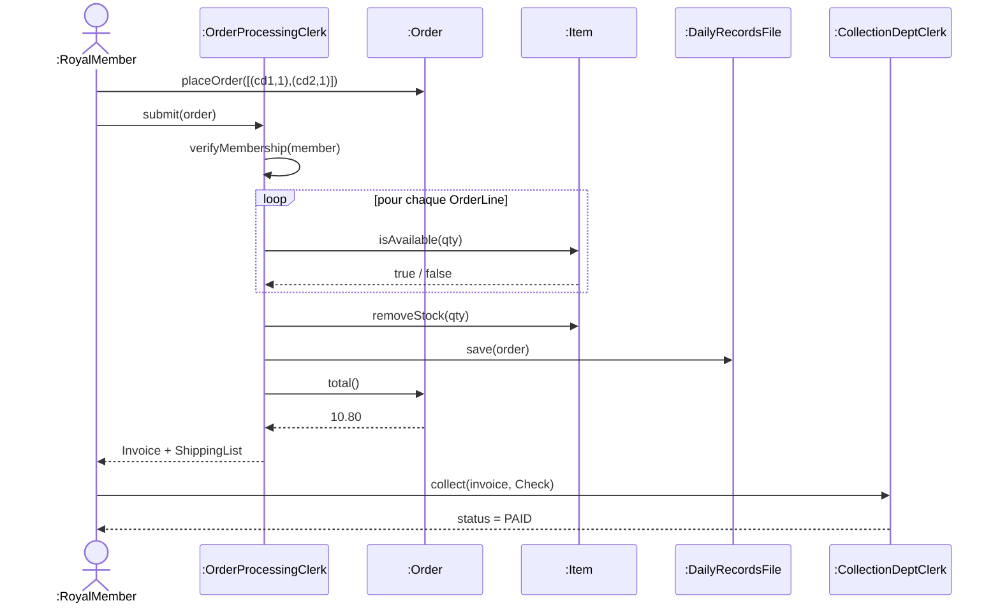

#### 2. Vérification d'adhésion (succès et échec)

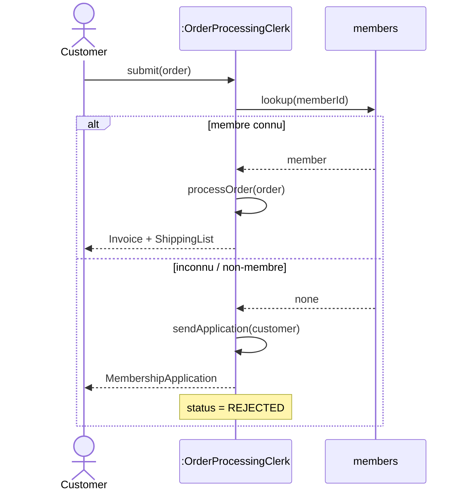

#### 3. Paiement (tous types)

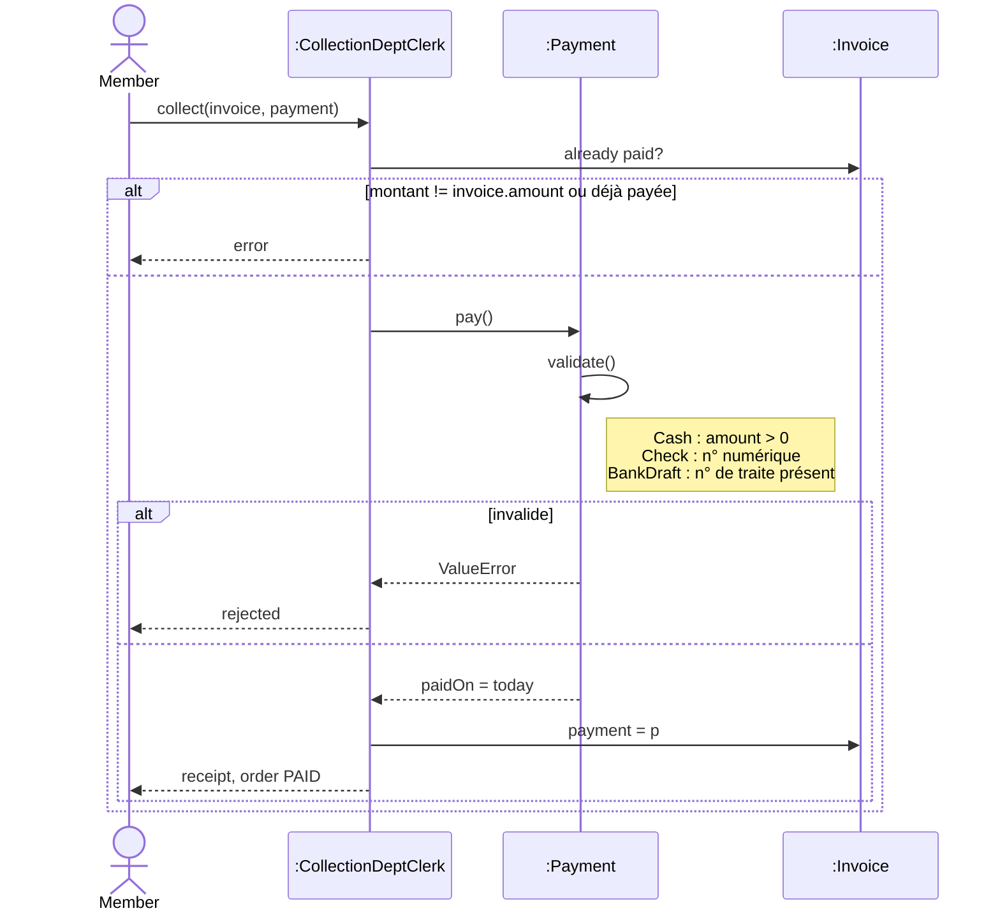

`K` appelle `pay()` sans connaître le type réel du paiement : c'est `validate()`, redéfinie dans chaque sous-classe, qui fait la différence (polymorphisme).

#### 4. Réapprovisionnement pour un membre Royal

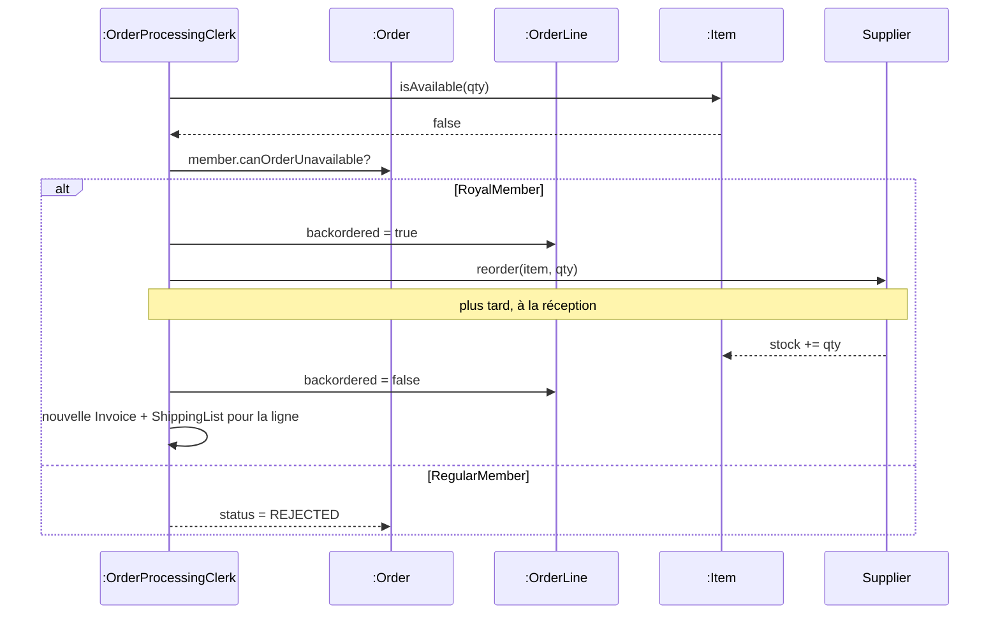

Dans le code, l'envoi au fournisseur est représenté par la liste `clerk.reorders` ; la réception et la seconde facture ne sont pas implémentées.
